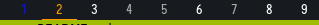

# Dotfiles.

## This repo includes:

* Variety
* herbstluftwm
* polybar
* Rofi
* Oh-My-ZSH

## Polybar herbsluftwm-tag colors

Numbers:
* Blue number: Is visible on other monitor
* Orange number: Is visible on this monitor
* White number: Tag is not empty.
* Gray number: Tag is empty.

Underlines:
* Blue underline: Is visible & focused on other monitor
* Orange underline: Is visible & focused on this monitor

## Resources and inspiration (Thank you all!)

The following list has no order.

* https://github.com/addy-dclxvi/almighty-dotfiles/                                     
* https://www.nerdfonts.com/
* https://herbstluftwm.org/
* https://github.com/polybar/polybar-scripts
* https://github.com/polybar/polybar
* https://github.com/varietywalls/variety/
* https://github.com/adi1090x/rofi
